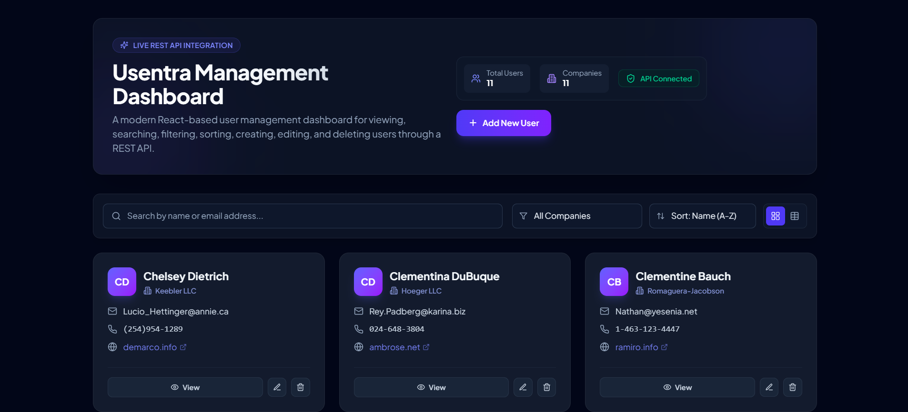
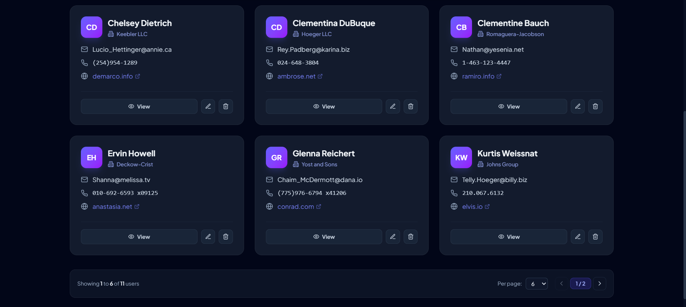
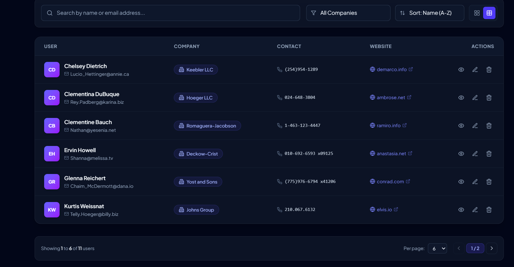
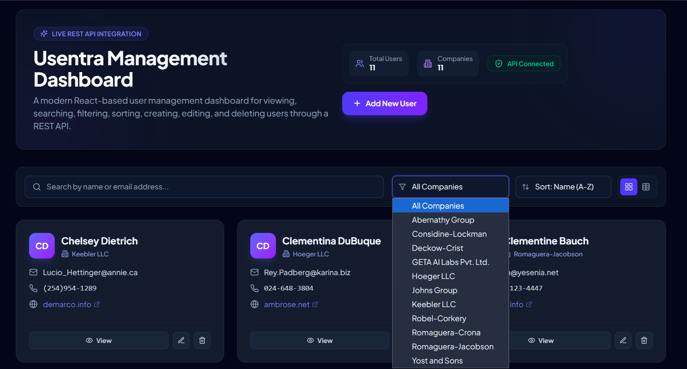
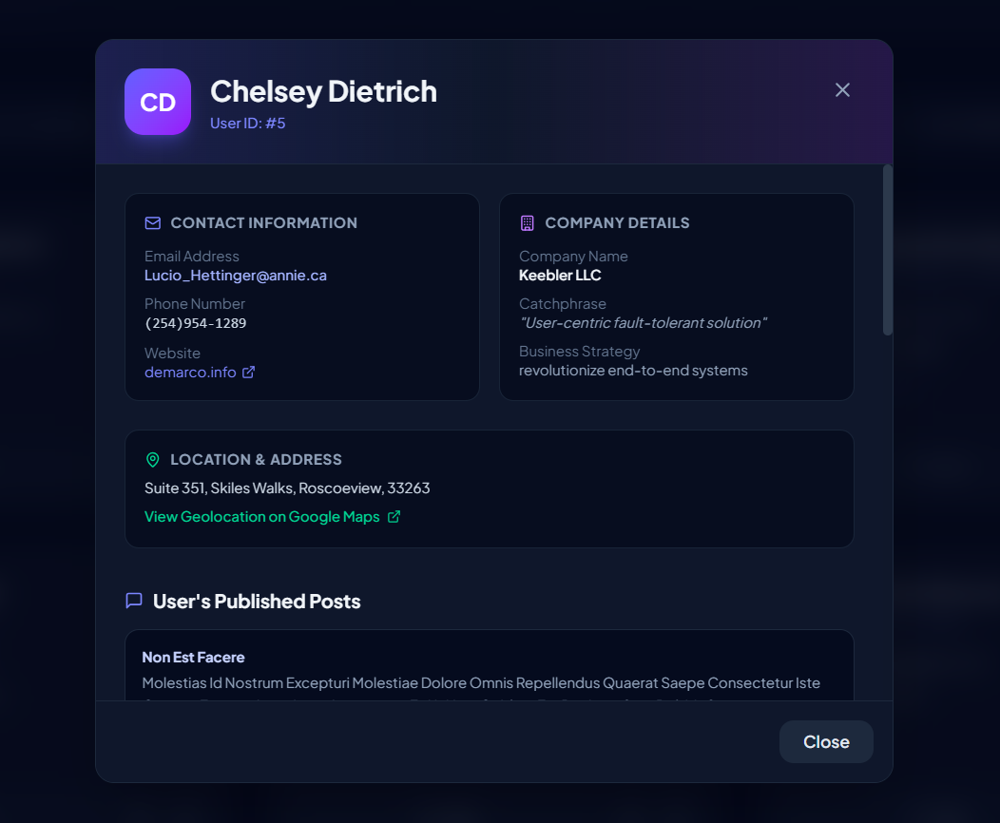
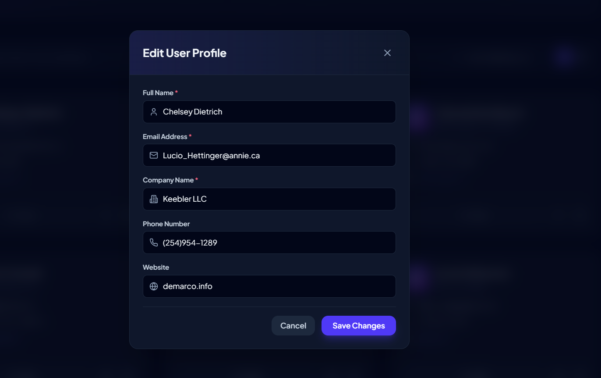
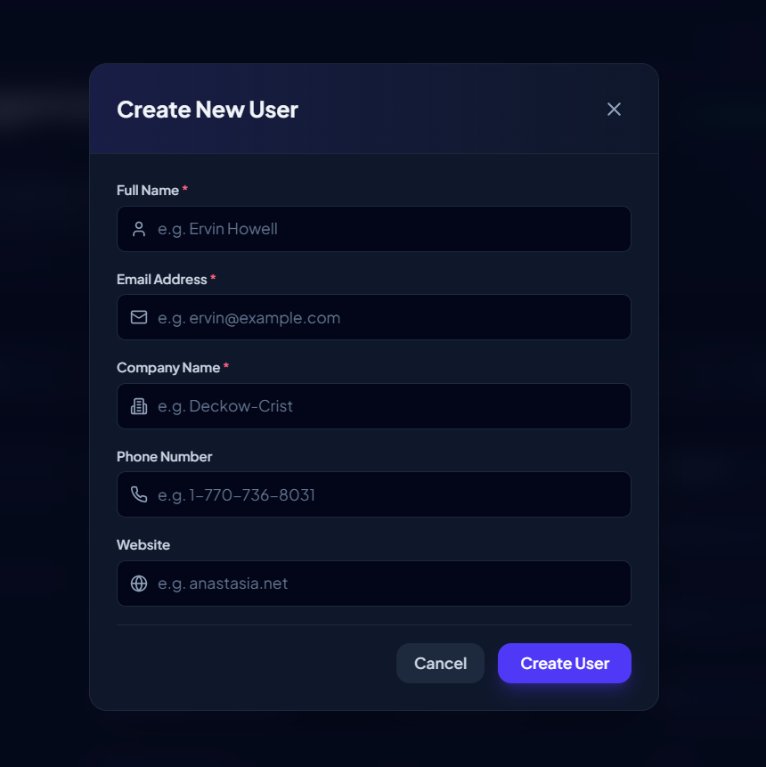

# Usentra Management Dashboard

A modern React-based **User Management Dashboard** for viewing and managing user data through a REST API. The interface provides a clean production-style experience for searching, filtering, sorting, creating, editing, viewing, and deleting users.

## ✨ Overview

Usentra Management Dashboard is a practical frontend application focused on REST API integration and user management.

### Main Features

- 👥 User management
- 🔎 Search by name or email
- 🏢 Filter by company
- ↕️ Sort users by name
- ➕ Create users
- ✏️ Edit users
- 🗑️ Delete users
- 👁️ View detailed user profiles
- 🌐 Website information
- 📍 Location/address information
- 📝 Published posts
- 🔌 API connection status
- 📋 Grid and table views
- 📄 Pagination
- 📱 Responsive layout
- 🎨 Modern dark production-style UI

---

## 🛠️ Tech Stack

### Frontend
- React
- Vite
- JavaScript / JSX
- CSS
- REST API
- Fetch API

### Development
- Node.js
- npm
- Git
- GitHub
- VS Code

> Install the exact additional libraries already listed in your project's `package.json`. This README does not invent package names or versions that were not provided.

---

## 🏗️ Architecture

```text
┌─────────────────────────────────────────────┐
│              React Application              │
│                                             │
│  ┌───────────────────────────────────────┐  │
│  │          Dashboard / App Shell        │  │
│  └──────────────────┬────────────────────┘  │
│                     │                       │
│       ┌─────────────┼─────────────┐         │
│       ▼             ▼             ▼         │
│ Search &        User Views      Modals      │
│ Filters       Grid / Table   Create / Edit  │
│       │             │             │         │
│       └─────────────┼─────────────┘         │
│                     ▼                       │
│              API / Service Layer            │
└─────────────────────┬───────────────────────┘
                      │
                      ▼
                  REST API
                      │
                      ▼
                  User Data
```

### Data Flow

```text
REST API
   ↓
Fetch data
   ↓
React state
   ↓
Search / Filter / Sort / Pagination
   ↓
Grid or Table
   ↓
Create / Update / Delete
   ↓
REST API
   ↓
Updated UI
```

---

## 📁 Suggested Project Structure

Use your actual filenames if your implementation differs.

```text
usentra-management-dashboard/
│
├── public/
│
├── src/
│   ├── components/
│   │   ├── DashboardHeader.jsx
│   │   ├── SearchBar.jsx
│   │   ├── FilterControls.jsx
│   │   ├── UserCard.jsx
│   │   ├── UserTable.jsx
│   │   ├── UserDetailsModal.jsx
│   │   ├── EditUserModal.jsx
│   │   ├── CreateUserModal.jsx
│   │   └── Pagination.jsx
│   │
│   ├── services/
│   │   └── api.js
│   │
│   ├── App.jsx
│   ├── main.jsx
│   └── index.css
│
├── screenshots/
│   ├── 01-dashboard-grid.png
│   ├── 02-dashboard-table.png
│   ├── 03-company-filter.png
│   ├── 04-user-details.png
│   ├── 05-edit-user.png
│   ├── 06-create-user.png
│   └── 07-additional-view.png
│
├── package.json
├── package-lock.json
├── vite.config.js
└── README.md
```

---

# 🚀 Features

### 1. Dashboard Overview
The header displays key information such as total users, companies, API connection status, and the **Add New User** action.

### 2. Search
Search users by name or email address.

### 3. Company Filter
Filter displayed users using the company dropdown.

### 4. Sorting
Sort users by name, including the displayed **Name (A–Z)** option.

### 5. Grid View
User cards display initials, name, company, email, phone, website, and actions.

### 6. Table View
The table organizes users into:

- User
- Company
- Contact
- Website
- Actions

### 7. User Details
The View action opens a detailed profile containing contact information, company details, location/address, and published posts.

### 8. Create User
The Create New User form includes:

- Full Name
- Email Address
- Company Name
- Phone Number
- Website

Required fields are marked.

### 9. Edit User
Existing user information can be edited through the Edit User Profile modal.

### 10. Delete User
Users can be deleted through the dashboard.

### 11. Pagination
The dashboard supports pagination for navigating larger datasets.

---

# 🔌 REST API Integration

The UI communicates with a REST API for user operations.

Typical operations:

```text
GET       → Fetch users
GET       → Fetch one user
POST      → Create user
PUT/PATCH → Update user
DELETE    → Delete user
```

Keep API URLs in one service/configuration location.

Example:

```env
VITE_API_BASE_URL=YOUR_API_BASE_URL
```

Example usage in Vite:

```js
const API_BASE_URL = import.meta.env.VITE_API_BASE_URL;
```

Replace `YOUR_API_BASE_URL` with your actual API URL.

**Never commit private API keys or secrets to GitHub.**

---

# 📦 Installation & Setup

## Prerequisites

Install:

- Node.js
- npm
- Git

Verify:

```bash
node --version
npm --version
git --version
```

## 1. Clone the repository

```bash
git clone YOUR_GITHUB_REPOSITORY_URL
cd usentra-management-dashboard
```

## 2. Install packages

```bash
npm install
```

This installs the dependencies declared in `package.json`.

## 3. Configure environment variables

Create `.env` in the project root if your application requires it:

```env
VITE_API_BASE_URL=YOUR_API_BASE_URL
```

Do not commit `.env` if it contains secrets.

Recommended `.gitignore` entries:

```text
.env
.env.local
```

## 4. Start the application

```bash
npm run dev
```

Open the local URL shown by Vite, commonly:

```text
http://localhost:5173
```

---

# 🏭 Production Build

Build:

```bash
npm run build
```

Preview:

```bash
npm run preview
```

---

# 🧪 Testing Checklist

### Data
- [ ] Users load correctly
- [ ] API status is displayed correctly
- [ ] Grid view works
- [ ] Table view works

### Search / Filter / Sort
- [ ] Name search works
- [ ] Email search works
- [ ] Company filter works
- [ ] Sorting works

### CRUD
- [ ] Create user works
- [ ] Edit user works
- [ ] Delete user works
- [ ] View details works

### UI
- [ ] Modals open and close
- [ ] Required fields are validated
- [ ] Pagination works
- [ ] Responsive layout works

### Error Handling
- [ ] API failures do not crash the UI
- [ ] Loading states are handled
- [ ] Empty results are handled
- [ ] Invalid form data is handled
- [ ] Failed CRUD operations provide feedback

---

# 🎨 UI / UX

The dashboard uses a modern production-inspired visual style:

- Dark theme
- Minimal layout
- Rounded cards and modals
- Clear visual hierarchy
- Purple primary actions
- Green API connection indicator
- Consistent spacing
- Icon-based actions
- Grid/table switching
- Responsive presentation

The goal is to keep the interface visually attractive without making it unnecessarily complicated.

---

# 🔐 Security Notes

- Do not expose private API keys in frontend code.
- Do not commit `.env` files containing secrets.
- Validate data on the frontend and backend.
- Use HTTPS in production.
- Implement authentication/authorization on the backend when required.
- Treat all user-provided data as untrusted input.

---

# ⚡ Performance

For production, consider:

- API-side pagination
- Debounced server-side search
- Avoiding unnecessary React re-renders
- Lazy loading where useful
- Asset optimization
- API response caching where appropriate

---

# 🔮 Future Improvements

Possible enhancements:

- 🌙 Light/Dark theme switch
- 🔐 Authentication and role-based access
- 📊 Analytics and charts
- 📤 CSV export
- 📥 CSV import
- 🔔 Toast notifications
- 🧾 Activity/audit logs
- 🧠 Advanced filtering
- 🧪 Automated tests
- 🚀 Production deployment
- 📱 Improved mobile navigation

---

# 🖼️ Screenshots

## Dashboard — Grid View



## Dashboard — Table View



## Company Filter



## User Details



## Edit User



## Create New User



## Additional View



---

# 📌 Project Status

**Status:** Completed frontend user-management dashboard with REST API integration and CRUD functionality.

---

# 👩‍💻 Author

**Saniya Hakim**

BE — Artificial Intelligence & Data Science

---

## ⭐ Support

If you find this project useful, consider giving the repository a ⭐ on GitHub.
